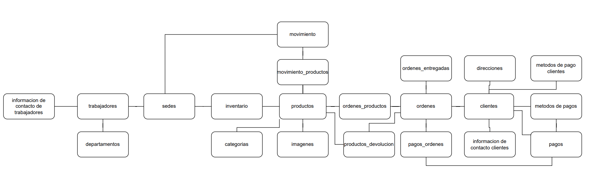

# Manual tecnico

## Herramientas

- Diagrams.net para el modelo conceptual
- Data modeler para la realización del modelo lógico y físico (utilizando la notación de Barker)
- MySQL como DBMS
- API realizada en Node JS

## Identificación de entidades y atributos

Se nos dan los Archivos csv de: ordenes, clientes, movimientos_productos, movimientos, productos_devolucion, ordenes_entregadas, pagos_ordenes, ordenes_productos, imagenes, inventario, productos, departamentos, pagos, trabajadores, sedes, categorias, direcciones.

A continuación se desglosan los datos de las tablas segun los datos proporcionador por los archivos csv y el enunciado del proyecto.

1. File ordenes
   1. id
   2. cliente_id
   3. location_id
   4. created_at
   5. updated_at
2. File ordenes_productos (relacionado con la tabla de ordenes)
   1. id
   2. order_id
   3. product_id
   4. quantity
   5. price
   6. created_at
   7. updated_at
3. File clientes
   1. id
   2. national_document
   3. name
   4. lastname
   5. phone
   6. email
   7. active (true / false)
   8. confirmed_email (true / false)
   9. password
   10. created_at
   11. updated_at
   12. address
   13. payment methods
4. File movimientos
   1. id
   2. location_origin_id
   3. location_dest_id
   4. status (approved, pending, rejected, REQUESTED)
   5. estimate_arrive_date
   6. requested_at
   7. created_at
   8. updated_at
5. File movimientos_productos (relacionada con la tabla de movimientos)
   1. id
   2. movement_id
   3. product_id
   4. quantity
   5. created_at
   6. updated_at
6. File productos_devolucion
   1. id
   2. product_id
   3. description
   4. status (pending, requested, approved, rejected)
   5. requested_at
   6. created_at
   7. updated_at
   8. order_id
7. File ordenes_entregadas
   1. id
   2. order_id
   3. company
   4. address
   5. number_company_guide
   6. status (delivered, failed, comming)
   7. delivered_at
   8. created_at
   9. updated_at
8. File productos
   1. id
   2. sku (code of letters and numbers)
   3. name
   4. description
   5. price
   6. slug (letters)
   7. category_id
   8. active (true/ false)
   9. created_at
   10. updated_at
9. File imagenes (relacionado con la tabla de productos)
   1. id
   2. product_id
   3. image (link)
   4. created_at
   5. updated_at
10. File inventario (relacionado con la tabla de productos)
    1. id
    2. product_id
    3. location_id
    4. quantity
    5. created_at
    6. updated_at
11. File departamentos
    1. id
    2. name
    3. created_at
    4. updated_at (transaction date)
12. File pagos_ordenes
    1. id
    2. order_id
    3. payment_method (credit card, bank transfer, electronic wallet)
    4. status (paid, pending, failed)
    5. created_at
    6. updated_at
    7. total_amount
13. File pagos (relacionada con la tabla de pagos_ordenes)
    1. id
    2. client_id
    3. payment_method
    4. created_at
    5. updated_at
14. File trabajadores
    1. id
    2. national_document
    3. name
    4. lastname
    5. job
    6. department_id
    7. phone
    8. email
    9. location_id
    10. active (true / false)
    11. created_at
    12. updated_at
15. File sedes
    1. id
    2. name
    3. created_at
    4. updated_at
16. File categorias
    1. id
    2. name
    3. created_at
    4. updated_at
17. File direcciones
    1. id
    2. client_id
    3. address
    4. created_at
    5. updated_at

## Normalizacion

Campos que deben de tener las tablas par cumplir con las tres formas de normalizacion

1.  ordenes

    1. id
    2. cliente_id
    3. location_id
    4. created_at
    5. updated_at

2.  ordenes_productos (relacionado con la tabla de ordenes)

    1. id
    2. order_id
    3. product_id
    4. quantity
    5. price
    6. created_at
    7. updated_at

3.  clientes

    1. id
    2. national_document
    3. name
    4. lastname
    5. password
    6. created_at
    7. updated_at

4.  Informacion de contacto clientes

    1. client_id
    2. phone
    3. email
    4. active (true / false)
    5. confirmed_email (true / false)
    6. created_at
    7. updated_at

5.  Metodos de pago cliente (relacionada con la tabla de Clientes)

    1. client_id
    2. id_type_payment_method (id de la tabla de metodos de pago)
    3. created_at
    4. updated_at

6.  movimientos

    1. id
    2. location_origin_id
    3. location_dest_id
    4. status (approved, pending, rejected, REQUESTED)
    5. estimate_arrive_date
    6. requested_at
    7. created_at
    8. updated_at

7.  movimientos_productos (relacionada con la tabla de movimientos)

    1. id
    2. movement_id
    3. product_id
    4. quantity
    5. created_at
    6. updated_at

8.  productos_devolucion

    1. id
    2. description
    3. status (pending, requested, approved, rejected)
    4. requested_at
    5. created_at
    6. updated_at
    7. order_id

9.  ordenes_entregadas

    1. id
    2. order_id
    3. company
    4. address
    5. number_company_guide
    6. status (delivered, failed, comming)
    7. delivered_at
    8. created_at
    9. updated_at

10. productos

    1. id
    2. sku (code of letters and numbers)
    3. name
    4. description
    5. price
    6. slug (letters)
    7. category_id
    8. active (true/ false)
    9. created_at
    10. updated_at

11. imagenes (relacionado con la tabla de productos)

    1. id
    2. product_id
    3. image (link)
    4. created_at
    5. updated_at

12. inventario (relacionado con la tabla de productos)

    1. id
    2. product_id
    3. location_id
    4. quantity
    5. created_at
    6. updated_at

13. departamentos

    1. id
    2. name
    3. created_at
    4. updated_at (transaction date)

14. pagos_ordenes

    1. id
    2. order_id
    3. status (paid, pending, failed)
    4. id_type_payment_method (id de la tabla de Metodos de pago)
    5. created_at
    6. updated_at
    7. total_amount

15. pagos (relacionada con la tabla de pagos_ordenes)

    1. id
    2. client_id
    3. id_type_payment_method (id de la tabla de Metodos de pago)
    4. created_at
    5. updated_at

16. Metodos de pagos

    1. id
    2. payment_method
    3. created_at
    4. updated_at

17. trabajadores

    1. id
    2. national_document
    3. name
    4. lastname
    5. job
    6. department_id
    7. created_at
    8. updated_at

18. Informacion de contacto de trabajadores

    1. id
    2. employee_id
    3. phone
    4. email
    5. location_id
    6. created_at
    7. updated_at
    8. active (true / false)

19. sedes

    1. id
    2. name
    3. created_at
    4. updated_at

20. categorias

    1. id
    2. name
    3. created_at
    4. updated_at

21. direcciones
    1. id
    2. client_id
    3. address
    4. created_at
    5. updated_at

## Diagrama matricial

|                 Tablas                  |   ordenes    | ordenes_productos |  clientes   | informacion de contacto clientes | metodos de pago clientes | movimientos | movimientos_productos | productos_devolucion | ordenes_entregadas |  productos   |  imagenes   | inventario | departamentos | pagos_ordenes |    pagos    | metodos de pago |  trabajadores  | Informacion de contacto de trabajadores |   sedes   | categorias  | direcciones  |
| :-------------------------------------: | :----------: | :---------------: | :---------: | :------------------------------: | :----------------------: | :---------: | :-------------------: | :------------------: | :----------------: | :----------: | :---------: | :--------: | :-----------: | :-----------: | :---------: | :-------------: | :------------: | :-------------------------------------: | :-------: | :---------: | :----------: |
|                 ordenes                 |      -       |   tiene - 1:\*    | tiene - 1:1 |            No aplica             |        No aplica         |  No aplica  |       No aplica       |      No aplica       |     No aplica      |  No aplica   |  No aplica  | No aplica  |   No aplica   |   No aplica   |  No aplica  |    No aplica    |   No aplica    |                No aplica                | No aplica |  No aplica  |  No aplica   |
|            ordenes_productos            |     son      |         -         |  No aplica  |            No aplica             |        No aplica         |  No aplica  |       No aplica       |      No aplica       |     No aplica      | tiene - 1:1  |  No aplica  | No aplica  |   No aplica   |   No aplica   |  No aplica  |    No aplica    |   No aplica    |                No aplica                | No aplica |  No aplica  |  No aplica   |
|                clientes                 | tiene - 1:\* |     No aplica     |      -      |           tiene - 1:1            |       tiene - 1:\*       |  No aplica  |       No aplica       |     tiene - 1:\*     |    tiene - 1:\*    |  No aplica   |  No aplica  | No aplica  |   No aplica   |  tiene - 1:1  |  No aplica  |  tiene - 1:\*   |   No aplica    |                No aplica                | No aplica |  No aplica  | tiene - 1:\* |
|    informacion de contacto clientes     |  No aplica   |     No aplica     |     son     |                -                 |        No aplica         |  No aplica  |       No aplica       |      No aplica       |     No aplica      |  No aplica   |  No aplica  | No aplica  |   No aplica   |   No aplica   |  No aplica  |    No aplica    |   No aplica    |                No aplica                | No aplica |  No aplica  |  No aplica   |
|        metodos de pago clientes         |  No aplica   |     No aplica     |     son     |            No aplica             |            -             |  No aplica  |       No aplica       |      No aplica       |     No aplica      |  No aplica   |  No aplica  | No aplica  |   No aplica   |   No aplica   |  No aplica  |    No aplica    |   No aplica    |                No aplica                | No aplica |  No aplica  |  No aplica   |
|               movimientos               |  No aplica   |     No aplica     |  No aplica  |            No aplica             |        No aplica         |      -      |     tiene - 1:\*      |      No aplica       |     No aplica      |  No aplica   |  No aplica  | No aplica  |   No aplica   |   No aplica   |  No aplica  |    No aplica    |   No aplica    |                No aplica                | No aplica |  No aplica  |  No aplica   |
|          movimientos_productos          |  No aplica   |     No aplica     |  No aplica  |            No aplica             |        No aplica         |     son     |           -           |      No aplica       |     No aplica      |  No aplica   |  No aplica  | No aplica  |   No aplica   |   No aplica   |  No aplica  |    No aplica    |   No aplica    |                No aplica                | No aplica |  No aplica  |  No aplica   |
|          productos_devolucion           | tiene - 1:\* |     No aplica     |  No aplica  |            No aplica             |        No aplica         |  No aplica  |       No aplica       |          -           |     No aplica      |  No aplica   |  No aplica  | No aplica  |   No aplica   |   No aplica   |  No aplica  |    No aplica    |   No aplica    |                No aplica                | No aplica |  No aplica  |  No aplica   |
|           ordenes_entregadas            |     son      |     No aplica     |  No aplica  |            No aplica             |        No aplica         |  No aplica  |       No aplica       |      No aplica       |         -          |  No aplica   |  No aplica  | No aplica  |   No aplica   |   No aplica   |  No aplica  |    No aplica    |   No aplica    |                No aplica                | No aplica |  No aplica  |  No aplica   |
|                productos                |  No aplica   |        son        |  No aplica  |            No aplica             |        No aplica         |  No aplica  |          son          |      No aplica       |     No aplica      |      -       | tiene - 1:1 | No aplica  |   No aplica   |   No aplica   |  No aplica  |    No aplica    |   No aplica    |                No aplica                | No aplica | tiene - 1:1 |  No aplica   |
|                imagenes                 |  No aplica   |     No aplica     |  No aplica  |            No aplica             |        No aplica         |  No aplica  |       No aplica       |      No aplica       |     No aplica      |     son      |      -      | No aplica  |   No aplica   |   No aplica   |  No aplica  |    No aplica    |   No aplica    |                No aplica                | No aplica |  No aplica  |  No aplica   |
|               inventario                |  No aplica   |     No aplica     |  No aplica  |            No aplica             |        No aplica         |  No aplica  |       No aplica       |      No aplica       |     No aplica      | tiene - 1:\* |  No aplica  |     -      |   No aplica   |   No aplica   |  No aplica  |    No aplica    |   No aplica    |                No aplica                | No aplica |  No aplica  |  No aplica   |
|              departamentos              |  No aplica   |     No aplica     |  No aplica  |            No aplica             |        No aplica         |  No aplica  |       No aplica       |      No aplica       |     No aplica      |  No aplica   |  No aplica  | No aplica  |       -       |   No aplica   |  No aplica  |    No aplica    | responsable de |                No aplica                | No aplica |  No aplica  |  No aplica   |
|              pagos_ordenes              | tiene - 1:1  |     No aplica     |  No aplica  |            No aplica             |        No aplica         |  No aplica  |       No aplica       |      No aplica       |     No aplica      |  No aplica   |  No aplica  | No aplica  |   No aplica   |       -       | tiene - 1:1 |   tiene - 1:1   |   No aplica    |                No aplica                | No aplica |  No aplica  |  No aplica   |
|                  pagos                  |  No aplica   |     No aplica     | tiene - 1:1 |            No aplica             |        No aplica         |  No aplica  |       No aplica       |      No aplica       |     No aplica      |  No aplica   |  No aplica  | No aplica  |   No aplica   |      son      |      -      |    No aplica    |   No aplica    |                No aplica                | No aplica |  No aplica  |  No aplica   |
|             metodos de pago             |  No aplica   |     No aplica     |  No aplica  |            No aplica             |        No aplica         |  No aplica  |       No aplica       |      No aplica       |     No aplica      |  No aplica   |  No aplica  | No aplica  |   No aplica   |   No aplica   |  No aplica  |        -        |   No aplica    |                No aplica                | No aplica |  No aplica  |  No aplica   |
|              trabajadores               |  No aplica   |     No aplica     |  No aplica  |            No aplica             |        No aplica         |  No aplica  |       No aplica       |      No aplica       |     No aplica      |  No aplica   |  No aplica  | No aplica  |  trabaja en   |   No aplica   |  No aplica  |    No aplica    |       -        |               tiene - 1:1               | No aplica |  No aplica  |  No aplica   |
| Informacion de contacto de trabajadores |  No aplica   |     No aplica     |  No aplica  |            No aplica             |        No aplica         |  No aplica  |       No aplica       |      No aplica       |     No aplica      |  No aplica   |  No aplica  | No aplica  |   No aplica   |   No aplica   |  No aplica  |    No aplica    |      son       |                    -                    | No aplica |  No aplica  |  No aplica   |
|                  sedes                  |  No aplica   |     No aplica     |  No aplica  |            No aplica             |        No aplica         |  No aplica  |       No aplica       |      No aplica       |     No aplica      |  No aplica   |  No aplica  |   tiene    |   No aplica   |   No aplica   |  No aplica  |    No aplica    |   No aplica    |                No aplica                |     -     |  No aplica  |  No aplica   |
|               categorias                |  No aplica   |     No aplica     |  No aplica  |            No aplica             |        No aplica         |  No aplica  |       No aplica       |      No aplica       |     No aplica      |   estan en   |  No aplica  | No aplica  |   No aplica   |   No aplica   |  No aplica  |    No aplica    |   No aplica    |                No aplica                | No aplica |      -      |  No aplica   |
|               direcciones               |  No aplica   |     No aplica     |  No aplica  |           forma parte            |        No aplica         |  No aplica  |       No aplica       |      No aplica       |     No aplica      |  No aplica   |  No aplica  | No aplica  |   No aplica   |   No aplica   |  No aplica  |    No aplica    |   No aplica    |                No aplica                | No aplica |  No aplica  |      -       |

## Modelo conceptual

## Modelo logico

[text](imgs/Logical.pdf)

## Modelo Relacional

[text](imgs/Relational_1.pdf)
